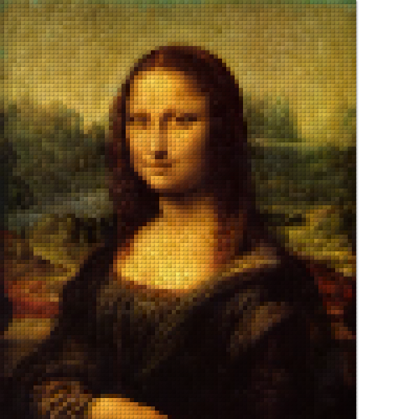

# MonaLego
> Visual testing for HTML canvas drawing

This [Legra.js](https://legrajs.com/) demo copied from from [legra-monalisa.glitch.me/](https://legra-monalisa.glitch.me/)

The test in [cypress/integration/spec.js](./cypress/integration/spec.js) changes the brick size and saves the produced Lego image as a local file.
