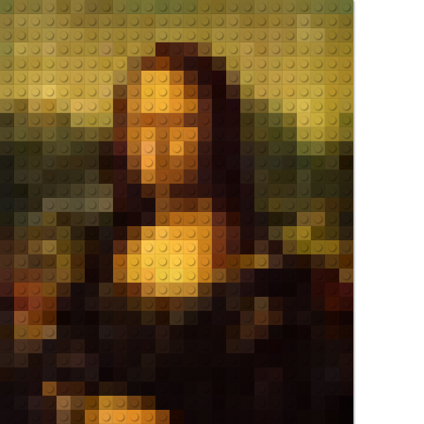
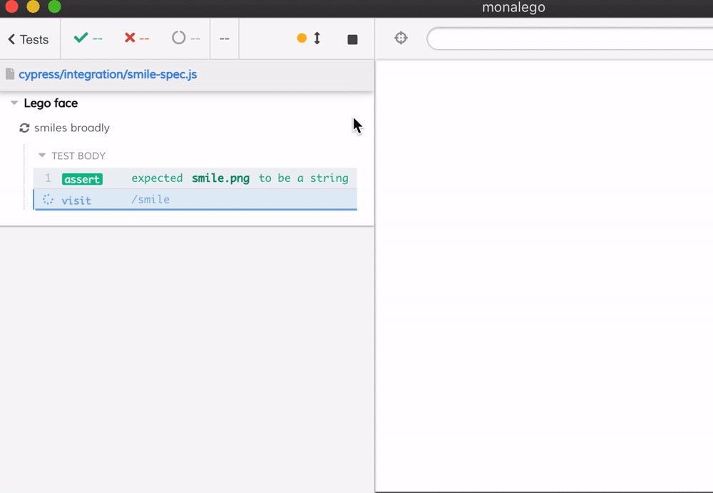
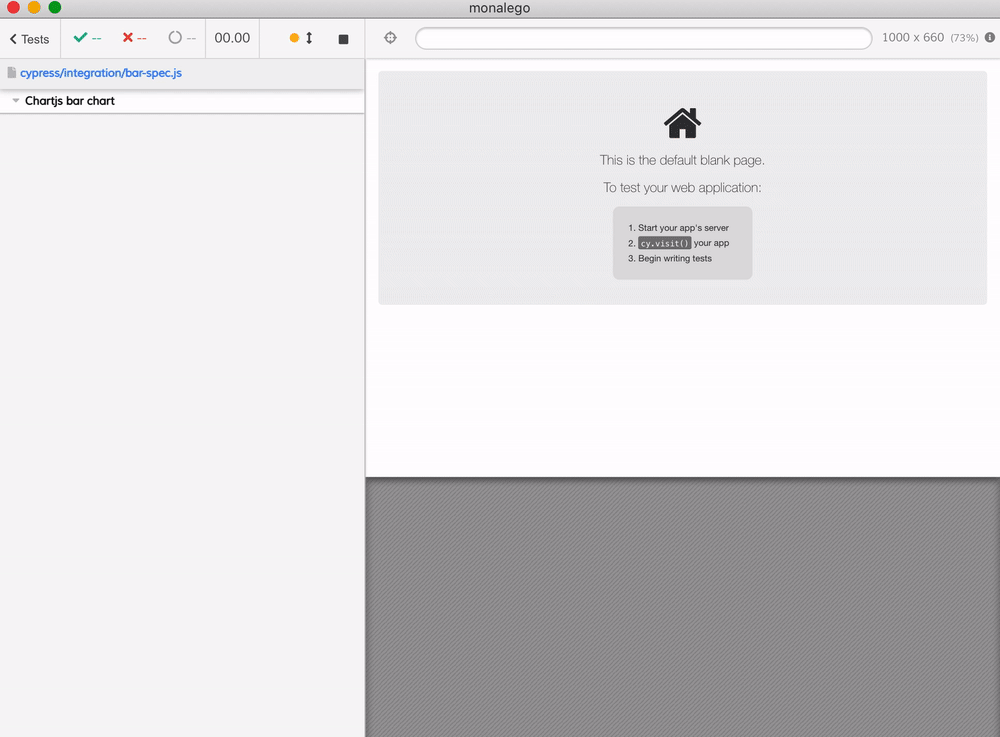

# MonaLego  [![ci status][ci image]][ci url] [![renovate-app badge][renovate-badge]][renovate-app]
> Visual testing for HTML canvas drawing

## Mona Lisa example

This [Legra.js](https://legrajs.com/) demo copied from from [legra-monalisa.glitch.me/](https://legra-monalisa.glitch.me/)

The test in [cypress/integration/mona-spec.js](./cypress/integration/mona-spec.js) changes the brick size and saves the produced Lego image as a local file.

Related: [Fast legoization](https://glebbahmutov.com/blog/fast-legoization/)

## Smiley face

Read [Canvas Visual Testing with Retries](https://glebbahmutov.com/blog/canvas-testing/), see the test [cypress/integration/smile-spec.js](./cypress/integration/smile-spec.js).

## Bar chart

An animated [Chart.js bar chart](https://www.chartjs.org/samples/latest/scriptable/bar.html) with multiple visual diffs against it. You can change the animation duration in [public/bar.html](./public/bar.html), the test should still work.

Watch [the video](https://youtu.be/aeBclf9A92A) for more details

[ci image]: https://github.com/bahmutov/monalego/workflows/main/badge.svg?branch=main
[ci url]: https://github.com/bahmutov/monalego/actions
[renovate-badge]: https://img.shields.io/badge/renovate-app-blue.svg
[renovate-app]: https://renovateapp.com/
